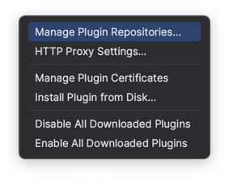

## CoTea IDE Plugin
Версия: 1.0

### Описание
При использовании библиотеки [CoTea @MikhailZhalskiy](https://github.com/MikhailZhalskiy/CoTea) для для каждого экрана требуется создать набор классов и интерфейсов.
Плагин позволяет упростить этот процесс и сгенерировать файлы автоматически.

Генерация файлов доступна из стандартного меню __New__ (Cmd+N/Ctrl+N) AS/IDEA

#### Вариант 1: Создать только классы необходимые для CoTea

__New__ > __CoTea__ > __CoTea Classes Only__


При создании требуется указать префикс и после этого в выбранной директории будут созданы
```
*Analytic
*Command
*CommandHandler
*Message
*SideEffect
*State
*StateUpdater
*StoreFactory
```
#### Вариант 2: Создать классы для экрана CoTea

__New__ > __CoTea__ > __CoTea Screen__

После указания имени экрана в выбранной директории будут созданы классы и интерфейсы
```
tea\
  *Analytic
  *Command
  *CommandHandler
  *Message
  *SideEffect
  *State
  *StateUpdater
  *StoreFactory
*ViewModel
```

### Как установить плагин

#### Вариант 1. Установка вручную
1. Выполнить gradle команду `./grdalew buildPlugin`. После сборки артефакт плагина будет помещен в папку `build\distributions`

2. Перейти в раздел Preferences -> Plugins IDE


3. Нажать на кнопку настроек и выбрать пункт "Install Plugin from Disk". 


#### Вариант 2. Установка из удаленного репозитория
1. Перейти в раздел Preferences -> Plugins IDE


2. Нажать на кнопку настроек и выбрать пункт "Manage Plugin Repositories..."



3. Добавить репозиторий https://mobicode.pro/idea/cotea/updatePlugins.xml


4. Найти в разделе __Marketplace__ плагин "CoTea Files Generator" и установить<br>


### Как выпустить новую версию плагина

1. Указать свойства для загрузки плагина в файле `local.properties`
```
PLUGIN_BASE_URL=

UPLOAD_HOST=
UPLOAD_USER=
UPLOAD_PWD=
UPLOAD_DIR=
```
2. Обновить версию плагина в файле `gradle.properties`
3. Запустить `./grdalew releasePlugin`